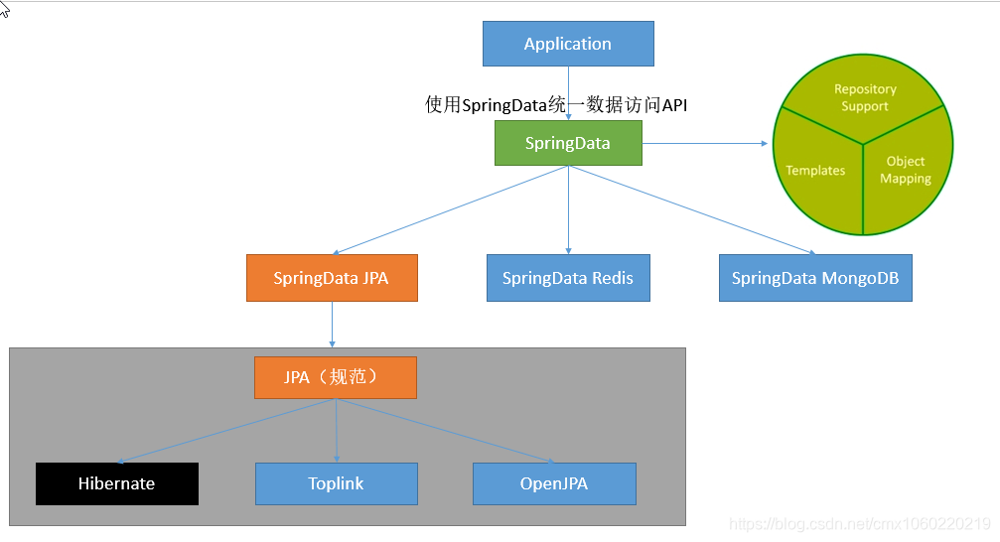

## Spring Data JPA
Spring Data JPA 是 Spring Data 项目的一部分，它提供了一种简化的数据访问方式，用于与关系型数据库进行交互。它基于 Java Persistence API（JPA） 标准，并提供了一套简洁的 API 和注解，使开发人员能够通过简单的 Java 对象来表示数据库表，并通过自动生成的 SQL 语句执行常见的 CRUD 操作。Spring Data JPA 通过封装 JPA 的复杂性，简化了数据访问层的开发工作，使开发人员能够更专注于业务逻辑的实现。它还提供了丰富的查询方法的定义、分页和排序支持、事务管理等功能，使开发人员能够更方便地进行数据访问和操作。



## Spring 整合JPA
1. 添加依赖
   首先，需要在项目的pom.xml文件中添加Spring Data JPA和数据库驱动的依赖。以下是一个示例，使用Spring Boot来自动配置大部分内容：
```xml
<dependencies>
   <dependency>
   <groupId>org.springframework.boot</groupId>
   <artifactId>spring-boot-starter-data-jpa</artifactId>
   </dependency>
   <dependency>
   <groupId>com.h2database</groupId>
   <artifactId>h2</artifactId>
   <scope>runtime</scope>
   </dependency>
   </dependencies>
```

2. 配置数据源
   接下来，需要在application.properties或application.yml中配置数据库连接。如果使用的是H2数据库，配置可能如下所示：
```properties
spring.datasource.url=jdbc:h2:mem:testdb
spring.datasource.driverClassName=org.h2.Driver
spring.datasource.username=sa
spring.datasource.password=password
spring.jpa.database-platform=org.hibernate.dialect.H2Dialect

```

3. 实体类定义
   使用JPA时，需要定义实体类并使用注解映射到数据库表。例如，一个简单的用户实体类可能如下：
```java
import javax.persistence.Entity;
import javax.persistence.Id;
import javax.persistence.GeneratedValue;
import javax.persistence.GenerationType;

@Entity
public class User {
    @Id
    @GeneratedValue(strategy = GenerationType.AUTO)
    private Long id;
    private String name;
    private String email;
    
    // Getters and Setters
}

```

4. 创建仓库接口
   Spring Data JPA使用仓库接口简化数据访问。定义一个接口继承JpaRepository或CrudRepository，Spring Data JPA会自动实现这个接口：

```java
import org.springframework.data.jpa.repository.JpaRepository;

public interface UserRepository extends JpaRepository<User, Long> {
}

```

5. 使用仓库进行数据操作
   现在，你可以在服务层或控制器中自动注入仓库接口的实例，并使用它进行数据操作：
```java
import org.springframework.beans.factory.annotation.Autowired;
import org.springframework.stereotype.Service;

@Service
public class UserService {

    @Autowired
    private UserRepository userRepository;
    
    public void addUser(User user) {
        userRepository.save(user);
    }
    
    // 其他业务方法
}

```

6. 启动类
   确保你的Spring Boot应用有一个启动类，它会自动配置和启动Spring应用上下文：
````java
import org.springframework.boot.SpringApplication;
import org.springframework.boot.autoconfigure.SpringBootApplication;

@SpringBootApplication
public class Application {
    public static void main(String[] args) {
        SpringApplication.run(Application.class, args);
    }
}

````


## 参考文档
[Spring Data JPA 中文文档](https://springdoc.cn/spring-data-jpa/)